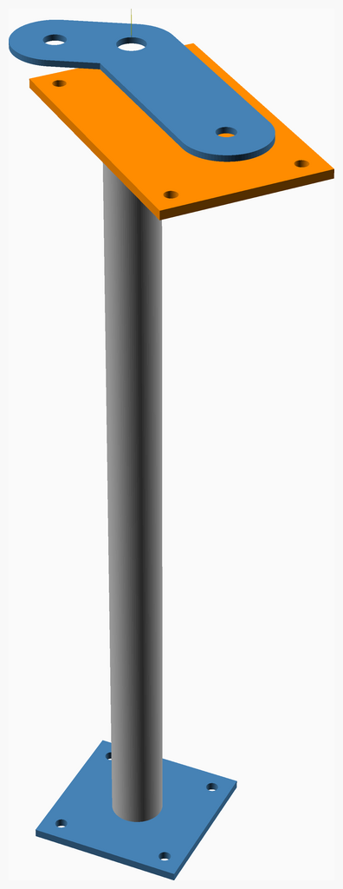
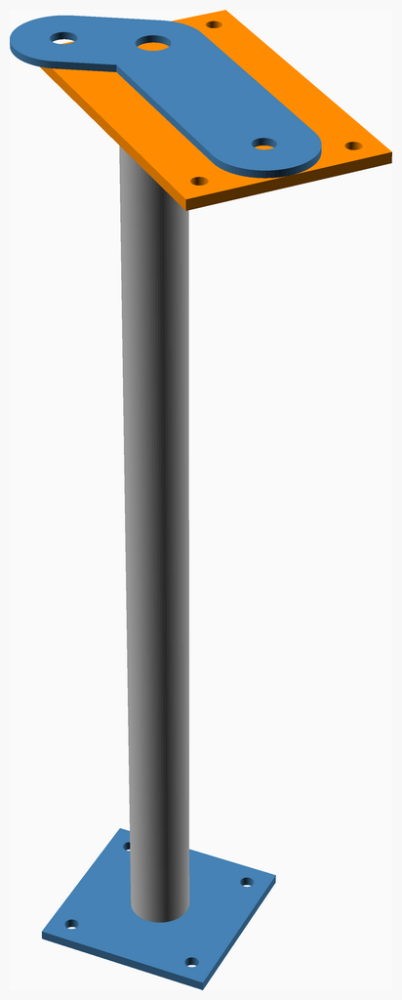
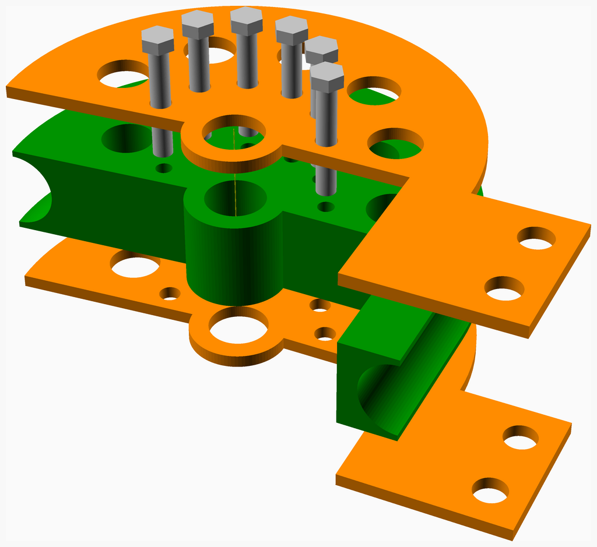
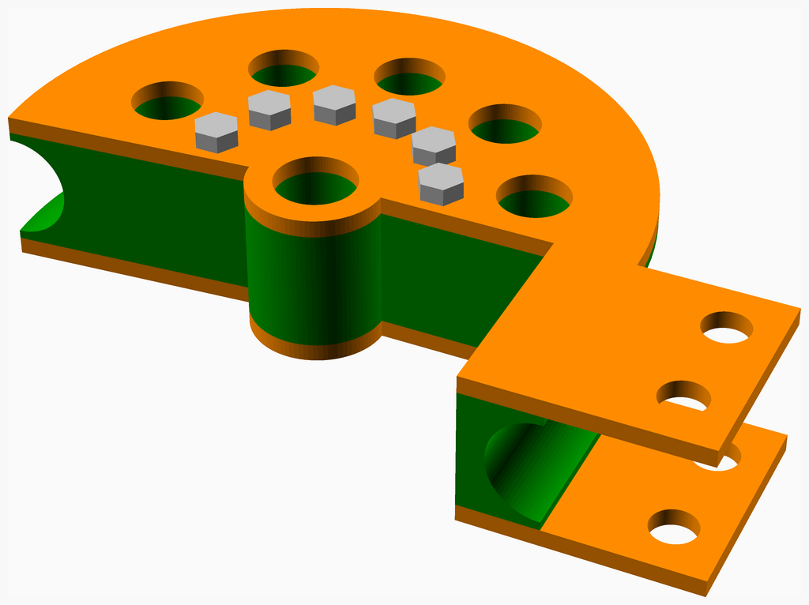
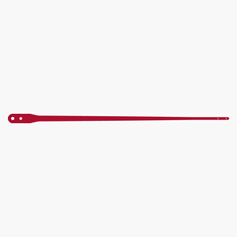
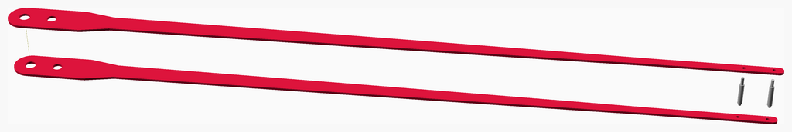
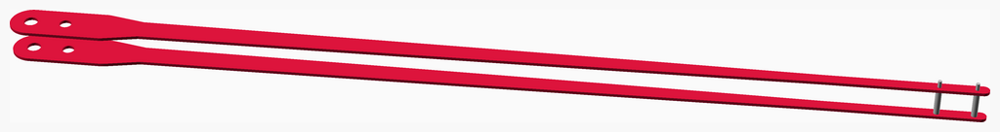
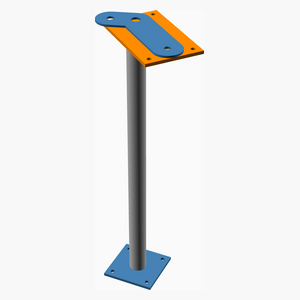
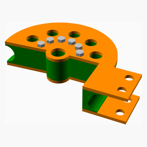
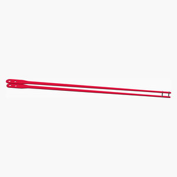

# Tube-bender
A parametric manual rotary-draw tube bender, from 1/8 in to 2 in outside diameter.

The machine is the swing-arm pattern that J D Squared and Pro-Tools have sold for
decades: a grooved forming die on a centre pivot, a U-strap clamping the tube to it, a
followbar reacting the bending load, and a drive link that rotates the die from a
handle. What is new here is that it is derived rather than drawn - the die comes from
the tube, the pins come from the loads they carry, and the base bolt pattern comes from
the torque it has to react.

Every part of the working mechanism is built and derived: the forming die - machined
from one plate or stacked from flat-cut slices, behind the same interface - its plates,
the clamp, the followbar, the tapered frame and drive links, the die lock that holds the
die against springback between strokes, and a bench base or a pedestal.

## Driving it

Open this file in OpenSCAD and use the **Customizer** (Window > Customizer). Everything
that decides what the machine is has a control there: the tube, the bend, the plate
stock, the die style, the mounting, and which part to look at. `tube_bender.json` beside
this file carries a few worked configurations to start from, including the 1-1/2 in
prototype and a sliced-die build for a shop with no mill.

The **Units** tab switches the report and the BOM between metric and imperial as a
whole system - length, force, moment, stress and mass together, because inches with
newtons is harder to check than either on its own. It changes nothing that is
calculated, and it changes no name: a tube is "1-1/2 in OD x 0.095 in wall" and plate is
ordered as "1/4 in" in both.

Nothing in the Customizer is a dimension of a part. Every part is derived from the tube
and the loads, so choosing a 1 in tube resizes the die, the pins, the links, the base
and the handle together - and the arithmetic behind that is echoed rather than hidden.
`just report` prints it, or read the console after any render.

## Two words in the parts list that are NopSCADlib's, not ours

Nothing here is printed. The list has a **"3D printed parts"** heading because that is
what NopSCADlib calls a part you make rather than buy, and under it are the three parts
with real depth to cut - the forming die, the clamp and the followbar - which are
**machined**. Everything flat is under **"CNC routed"**, which is right: those go to a
laser, waterjet or plasma table as the DXF files linked beside them.

Why the numbers are what they are, and what each one rests on, is in
[docs/design-basis.md](docs/design-basis.md). What the Onshape prototype this was
started from actually measured, and which of its features survived, is in
[docs/reverse-engineering.md](docs/reverse-engineering.md).

---
## Table of Contents
1. [Parts list](#Parts_list)
1. [Base Assembly](#base_assembly)
1. [Die Assembly](#die_assembly)
1. [Handle Assembly](#handle_assembly)
1. [Main Assembly](#main_assembly)

[Top](#TOP)

---

## Parts list
| Base | Die | Handle | Main | TOTALS |  |
|---:|---:|---:|---:|---:|:---|
|  |  |  |  | | **Vitamins** |
| &nbsp;&nbsp;.&nbsp; | &nbsp;&nbsp;.&nbsp; | &nbsp;&nbsp;.&nbsp; | &nbsp;&nbsp;8&nbsp; |  &nbsp;&nbsp;8&nbsp; | &nbsp;&nbsp; Bolt hex head 1/2 in x 44.45 mm, with nut and washers, NO ORDER NUMBER - this row is a hole in the BOM |
| &nbsp;&nbsp;.&nbsp; | &nbsp;&nbsp;.&nbsp; | &nbsp;&nbsp;.&nbsp; | &nbsp;&nbsp;1&nbsp; |  &nbsp;&nbsp;1&nbsp; | &nbsp;&nbsp; Bolt hex head 3/8 in x 38.1 mm, with nut and washers, NO ORDER NUMBER - this row is a hole in the BOM |
| &nbsp;&nbsp;.&nbsp; | &nbsp;&nbsp;6&nbsp; | &nbsp;&nbsp;.&nbsp; | &nbsp;&nbsp;.&nbsp; |  &nbsp;&nbsp;6&nbsp; | &nbsp;&nbsp; Bolt hex head 3/8 in x 57.15 mm, with nut and washers, NO ORDER NUMBER - this row is a hole in the BOM |
| &nbsp;&nbsp;.&nbsp; | &nbsp;&nbsp;.&nbsp; | &nbsp;&nbsp;.&nbsp; | &nbsp;&nbsp;1&nbsp; |  &nbsp;&nbsp;1&nbsp; | &nbsp;&nbsp; Cotter pin to suit a 1-1/8 in dia clevis pin, NO ORDER NUMBER - this row is a hole in the BOM |
| &nbsp;&nbsp;.&nbsp; | &nbsp;&nbsp;.&nbsp; | &nbsp;&nbsp;.&nbsp; | &nbsp;&nbsp;1&nbsp; |  &nbsp;&nbsp;1&nbsp; | &nbsp;&nbsp; Cotter pin to suit a 3/4 in dia clevis pin, NO ORDER NUMBER - this row is a hole in the BOM |
| &nbsp;&nbsp;.&nbsp; | &nbsp;&nbsp;.&nbsp; | &nbsp;&nbsp;2&nbsp; | &nbsp;&nbsp;.&nbsp; |  &nbsp;&nbsp;2&nbsp; | &nbsp;&nbsp; Cotter pin to suit a 5/16 in dia clevis pin, NO ORDER NUMBER - this row is a hole in the BOM |
| &nbsp;&nbsp;.&nbsp; | &nbsp;&nbsp;.&nbsp; | &nbsp;&nbsp;.&nbsp; | &nbsp;&nbsp;2&nbsp; |  &nbsp;&nbsp;2&nbsp; | &nbsp;&nbsp; Cotter pin to suit a 5/8 in dia clevis pin, NO ORDER NUMBER - this row is a hole in the BOM |
| &nbsp;&nbsp;.&nbsp; | &nbsp;&nbsp;.&nbsp; | &nbsp;&nbsp;.&nbsp; | &nbsp;&nbsp;1&nbsp; |  &nbsp;&nbsp;1&nbsp; | &nbsp;&nbsp; Pin clevis 1-1/8 in dia x 88.9 mm usable, NO ORDER NUMBER - this row is a hole in the BOM |
| &nbsp;&nbsp;.&nbsp; | &nbsp;&nbsp;.&nbsp; | &nbsp;&nbsp;.&nbsp; | &nbsp;&nbsp;1&nbsp; |  &nbsp;&nbsp;1&nbsp; | &nbsp;&nbsp; Pin clevis 3/4 in dia x 88.9 mm usable, 98306A868 |
| &nbsp;&nbsp;.&nbsp; | &nbsp;&nbsp;.&nbsp; | &nbsp;&nbsp;2&nbsp; | &nbsp;&nbsp;.&nbsp; |  &nbsp;&nbsp;2&nbsp; | &nbsp;&nbsp; Pin clevis 5/16 in dia x 82.55 mm usable, NO ORDER NUMBER - this row is a hole in the BOM |
| &nbsp;&nbsp;.&nbsp; | &nbsp;&nbsp;.&nbsp; | &nbsp;&nbsp;.&nbsp; | &nbsp;&nbsp;2&nbsp; |  &nbsp;&nbsp;2&nbsp; | &nbsp;&nbsp; Pin clevis 5/8 in dia x 57.15 mm usable, NO ORDER NUMBER - this row is a hole in the BOM |
| &nbsp;&nbsp;.&nbsp; | &nbsp;&nbsp;.&nbsp; | &nbsp;&nbsp;.&nbsp; | &nbsp;&nbsp;1&nbsp; |  &nbsp;&nbsp;1&nbsp; | &nbsp;&nbsp; Pin clevis 7/8 in dia x 82.55 mm usable, NO ORDER NUMBER - this row is a hole in the BOM |
| &nbsp;&nbsp;.&nbsp; | &nbsp;&nbsp;.&nbsp; | &nbsp;&nbsp;.&nbsp; | &nbsp;&nbsp;1&nbsp; |  &nbsp;&nbsp;1&nbsp; | &nbsp;&nbsp; Pin clevis 7/8 in dia x 88.9 mm usable, NO ORDER NUMBER - this row is a hole in the BOM |
| &nbsp;&nbsp;.&nbsp; | &nbsp;&nbsp;.&nbsp; | &nbsp;&nbsp;.&nbsp; | &nbsp;&nbsp;2&nbsp; |  &nbsp;&nbsp;2&nbsp; | &nbsp;&nbsp; Pin clip to suit a 7/8 in dia clevis pin that is pulled every stroke, NO ORDER NUMBER - this row is a hole in the BOM |
| &nbsp;&nbsp;.&nbsp; | &nbsp;&nbsp;1&nbsp; | &nbsp;&nbsp;.&nbsp; | &nbsp;&nbsp;.&nbsp; |  &nbsp;&nbsp;1&nbsp; | &nbsp;&nbsp; Plate mild steel 1-3/4 in, blank 228.6 x 190.5 mm, faced to 44.45 mm |
| &nbsp;&nbsp;.&nbsp; | &nbsp;&nbsp;.&nbsp; | &nbsp;&nbsp;.&nbsp; | &nbsp;&nbsp;1&nbsp; |  &nbsp;&nbsp;1&nbsp; | &nbsp;&nbsp; Plate mild steel 1-3/4 in, blank 54.37 x 76.2 mm, faced to 44.45 mm |
| &nbsp;&nbsp;.&nbsp; | &nbsp;&nbsp;.&nbsp; | &nbsp;&nbsp;.&nbsp; | &nbsp;&nbsp;1&nbsp; |  &nbsp;&nbsp;1&nbsp; | &nbsp;&nbsp; Plate mild steel 1-3/4 in, blank 57.55 x 76.2 mm, faced to 44.45 mm |
| &nbsp;&nbsp;.&nbsp; | &nbsp;&nbsp;.&nbsp; | &nbsp;&nbsp;2&nbsp; | &nbsp;&nbsp;.&nbsp; |  &nbsp;&nbsp;2&nbsp; | &nbsp;&nbsp; Plate mild steel 1/4 in, blank 2034.1 x 86.93 mm |
| &nbsp;&nbsp;.&nbsp; | &nbsp;&nbsp;2&nbsp; | &nbsp;&nbsp;.&nbsp; | &nbsp;&nbsp;.&nbsp; |  &nbsp;&nbsp;2&nbsp; | &nbsp;&nbsp; Plate mild steel 1/4 in, blank 228.6 x 190.5 mm |
| &nbsp;&nbsp;1&nbsp; | &nbsp;&nbsp;.&nbsp; | &nbsp;&nbsp;.&nbsp; | &nbsp;&nbsp;1&nbsp; |  &nbsp;&nbsp;2&nbsp; | &nbsp;&nbsp; Plate mild steel 1/4 in, blank 309.09 x 232.97 mm |
| &nbsp;&nbsp;1&nbsp; | &nbsp;&nbsp;.&nbsp; | &nbsp;&nbsp;.&nbsp; | &nbsp;&nbsp;.&nbsp; |  &nbsp;&nbsp;1&nbsp; | &nbsp;&nbsp; Plate mild steel 3/8 in, blank 171.45 x 171.45 mm |
| &nbsp;&nbsp;1&nbsp; | &nbsp;&nbsp;.&nbsp; | &nbsp;&nbsp;.&nbsp; | &nbsp;&nbsp;.&nbsp; |  &nbsp;&nbsp;1&nbsp; | &nbsp;&nbsp; Plate mild steel 3/8 in, blank 283.44 x 173.85 mm |
| &nbsp;&nbsp;.&nbsp; | &nbsp;&nbsp;.&nbsp; | &nbsp;&nbsp;.&nbsp; | &nbsp;&nbsp;1&nbsp; |  &nbsp;&nbsp;1&nbsp; | &nbsp;&nbsp; Tube 1-1/2 in OD x 0.095 in wall, ASTM A513 Type 1 ERW mild steel, as-welded, length 600 mm |
| &nbsp;&nbsp;.&nbsp; | &nbsp;&nbsp;.&nbsp; | &nbsp;&nbsp;2&nbsp; | &nbsp;&nbsp;.&nbsp; |  &nbsp;&nbsp;2&nbsp; | &nbsp;&nbsp; Tube 1/2 in OD x 0.065 in wall, mild steel, length 58.15 mm |
| &nbsp;&nbsp;1&nbsp; | &nbsp;&nbsp;.&nbsp; | &nbsp;&nbsp;.&nbsp; | &nbsp;&nbsp;.&nbsp; |  &nbsp;&nbsp;1&nbsp; | &nbsp;&nbsp; Tube 2-1/4 in OD x 0.120 in wall, mild steel, length 898.2 mm |
| &nbsp;&nbsp;4&nbsp; | &nbsp;&nbsp;9&nbsp; | &nbsp;&nbsp;8&nbsp; | &nbsp;&nbsp;25&nbsp; | &nbsp;&nbsp;46&nbsp; | &nbsp;&nbsp;Total vitamins count |
|  |  |  |  | | **3D printed parts** |
| &nbsp;&nbsp;.&nbsp; | &nbsp;&nbsp;.&nbsp; | &nbsp;&nbsp;.&nbsp; | &nbsp;&nbsp;1&nbsp; |  &nbsp;&nbsp;1&nbsp; | &nbsp;&nbsp;clamp.stl |
| &nbsp;&nbsp;.&nbsp; | &nbsp;&nbsp;.&nbsp; | &nbsp;&nbsp;.&nbsp; | &nbsp;&nbsp;1&nbsp; |  &nbsp;&nbsp;1&nbsp; | &nbsp;&nbsp;followbar.stl |
| &nbsp;&nbsp;.&nbsp; | &nbsp;&nbsp;1&nbsp; | &nbsp;&nbsp;.&nbsp; | &nbsp;&nbsp;.&nbsp; |  &nbsp;&nbsp;1&nbsp; | &nbsp;&nbsp;forming_die.stl |
| &nbsp;&nbsp;.&nbsp; | &nbsp;&nbsp;1&nbsp; | &nbsp;&nbsp;.&nbsp; | &nbsp;&nbsp;2&nbsp; | &nbsp;&nbsp;3&nbsp; | &nbsp;&nbsp;Total 3D printed parts count |
|  |  |  |  | | **CNC routed parts** |
| &nbsp;&nbsp;1&nbsp; | &nbsp;&nbsp;.&nbsp; | &nbsp;&nbsp;.&nbsp; | &nbsp;&nbsp;.&nbsp; |  &nbsp;&nbsp;1&nbsp; | &nbsp;&nbsp;base.dxf |
| &nbsp;&nbsp;.&nbsp; | &nbsp;&nbsp;2&nbsp; | &nbsp;&nbsp;.&nbsp; | &nbsp;&nbsp;.&nbsp; |  &nbsp;&nbsp;2&nbsp; | &nbsp;&nbsp;die_plate.dxf |
| &nbsp;&nbsp;.&nbsp; | &nbsp;&nbsp;.&nbsp; | &nbsp;&nbsp;2&nbsp; | &nbsp;&nbsp;.&nbsp; |  &nbsp;&nbsp;2&nbsp; | &nbsp;&nbsp;drive_link.dxf |
| &nbsp;&nbsp;1&nbsp; | &nbsp;&nbsp;.&nbsp; | &nbsp;&nbsp;.&nbsp; | &nbsp;&nbsp;1&nbsp; |  &nbsp;&nbsp;2&nbsp; | &nbsp;&nbsp;frame_link.dxf |
| &nbsp;&nbsp;1&nbsp; | &nbsp;&nbsp;.&nbsp; | &nbsp;&nbsp;.&nbsp; | &nbsp;&nbsp;.&nbsp; |  &nbsp;&nbsp;1&nbsp; | &nbsp;&nbsp;pedestal_foot.dxf |
| &nbsp;&nbsp;3&nbsp; | &nbsp;&nbsp;2&nbsp; | &nbsp;&nbsp;2&nbsp; | &nbsp;&nbsp;1&nbsp; | &nbsp;&nbsp;8&nbsp; | &nbsp;&nbsp;Total CNC routed parts count |

[Top](#TOP)

---

## Base Assembly
### Vitamins
|Qty|Description|
|---:|:----------|
|1| Plate mild steel 1/4 in, blank 309.09 x 232.97 mm|
|1| Plate mild steel 3/8 in, blank 171.45 x 171.45 mm|
|1| Plate mild steel 3/8 in, blank 283.44 x 173.85 mm|
|1| Tube 2-1/4 in OD x 0.120 in wall, mild steel, length 898.2 mm|

### CNC Routed parts

| 1 x [base.dxf](dxfs/base.dxf) | 1 x [frame_link.dxf](dxfs/frame_link.dxf) | 1 x [pedestal_foot.dxf](dxfs/pedestal_foot.dxf) |
|---|---|---|
|  |  |  

### Assembly instructions

**Stage 1 - the base weldment.** The lower frame link is welded flat to the base plate,
and this is the joint the whole drive torque leaves through, so it is worth getting
right before anything else exists to be in the way.

Fillet **both edges** of the link where it lands on the plate, over the full run from
the pivot to the followbar eye. The leg is not written here on purpose - it is a
function of the plate you chose, so `just report` is where it lives and a number in this
sentence would be a lie for every configuration but one. It comes out at the code
minimum for every size in the range, with a factor of about six in hand on the load, so
what to be careful about is fusion and distortion rather than size. Tack both ends,
check the link is still flat and still square to the plate, then run it.

On a pedestal build the post is welded to the underside of the plate at the same
setting, and to its foot at the other end. Both are a ring of fillet round the post's
outside diameter; the bore in the foot is there so a second pass can be run inside it.
Those two ARE load-sized rather than minimum-sized - the report says which - so they
want a real bead, not a tack.

[Top](#TOP)

---

## Die Assembly
### Vitamins
|Qty|Description|
|---:|:----------|
|6| Bolt hex head 3/8 in x 57.15 mm, with nut and washers, NO ORDER NUMBER - this row is a hole in the BOM|
|1| Plate mild steel 1-3/4 in, blank 228.6 x 190.5 mm, faced to 44.45 mm|
|2| Plate mild steel 1/4 in, blank 228.6 x 190.5 mm|

### 3D Printed parts

| 1 x [forming_die.stl](stls/forming_die.stl) |
|---|
|  

### CNC Routed parts

| 2 x [die_plate.dxf](dxfs/die_plate.dxf) |
|---|
|  

### Assembly instructions

**Stage 2 - the die.** The two die plates bolt to the faces of the forming die and never
come off again. They are what the clamp pins to, so their tails have to line up with
each other: bolt one on, use it to spot the other, and check the two tails are parallel
before anything is tightened.

The bolts sit on a circle between the hub and the drive holes. The report gives the
shear in each against its allowable; they carry the clamp's whole drag on the tube plus
the moment that drag makes about the pivot, so they are not incidental fixings.

[Top](#TOP)

---

## Handle Assembly
### Vitamins
|Qty|Description|
|---:|:----------|
|2| Cotter pin to suit a 5/16 in dia clevis pin, NO ORDER NUMBER - this row is a hole in the BOM|
|2| Pin clevis 5/16 in dia x 82.55 mm usable, NO ORDER NUMBER - this row is a hole in the BOM|
|2| Plate mild steel 1/4 in, blank 2034.1 x 86.93 mm|
|2| Tube 1/2 in OD x 0.065 in wall, mild steel, length 58.15 mm|

### CNC Routed parts

| 2 x [drive_link.dxf](dxfs/drive_link.dxf) |
|---|
|  

### Assembly instructions

**Stage 3 - the handle.** The two drive links are joined by the two spacer bolts at the
grip, each running through a length of tube that sets the gap and stops the pair being
pulled together when the bolts are done up. Without those tubes the bolts close the fork
and the die will not go in.

Join them at the grip end only. The pivot end has to stay open, because that is where
the die assembly slides in at the next stage.

[Top](#TOP)

---

## Main Assembly
### Vitamins
|Qty|Description|
|---:|:----------|
|8| Bolt hex head 1/2 in x 44.45 mm, with nut and washers, NO ORDER NUMBER - this row is a hole in the BOM|
|1| Bolt hex head 3/8 in x 38.1 mm, with nut and washers, NO ORDER NUMBER - this row is a hole in the BOM|
|1| Cotter pin to suit a 1-1/8 in dia clevis pin, NO ORDER NUMBER - this row is a hole in the BOM|
|1| Cotter pin to suit a 3/4 in dia clevis pin, NO ORDER NUMBER - this row is a hole in the BOM|
|2| Cotter pin to suit a 5/8 in dia clevis pin, NO ORDER NUMBER - this row is a hole in the BOM|
|1| Pin clevis 1-1/8 in dia x 88.9 mm usable, NO ORDER NUMBER - this row is a hole in the BOM|
|1| Pin clevis 3/4 in dia x 88.9 mm usable, 98306A868|
|2| Pin clevis 5/8 in dia x 57.15 mm usable, NO ORDER NUMBER - this row is a hole in the BOM|
|1| Pin clevis 7/8 in dia x 82.55 mm usable, NO ORDER NUMBER - this row is a hole in the BOM|
|1| Pin clevis 7/8 in dia x 88.9 mm usable, NO ORDER NUMBER - this row is a hole in the BOM|
|2| Pin clip to suit a 7/8 in dia clevis pin that is pulled every stroke, NO ORDER NUMBER - this row is a hole in the BOM|
|1| Plate mild steel 1-3/4 in, blank 54.37 x 76.2 mm, faced to 44.45 mm|
|1| Plate mild steel 1-3/4 in, blank 57.55 x 76.2 mm, faced to 44.45 mm|
|1| Plate mild steel 1/4 in, blank 309.09 x 232.97 mm|
|1| Tube 1-1/2 in OD x 0.095 in wall, ASTM A513 Type 1 ERW mild steel, as-welded, length 600 mm|

### 3D Printed parts

| 1 x [clamp.stl](stls/clamp.stl) | 1 x [followbar.stl](stls/followbar.stl) |
|---|---|
|  |  

### CNC Routed parts

| 1 x [frame_link.dxf](dxfs/frame_link.dxf) |
|---|
|  

### Sub-assemblies

| 1 x base_assembly | 1 x die_assembly | 1 x handle_assembly |
|---|---|---|
|  |  |  

### Assembly instructions

**Stage 4 - the machine.** Everything stacks bottom up on the base weldment, in the
order the stack itself is in: lower drive link, die assembly, upper drive link, upper
frame link.

The handle pair is a fork joined only at its far end, so the die assembly slides into it
from the pivot end rather than being lowered in. Line the two up, drop the frame pin
through the lot, and fit its retainer at the top.

Then the followbar, on its own pin between the frame links; the clamp, pinned to the die
plates' tails with its bolt left slack until a tube is in; and the die lock pin, which
goes in from the top through whichever drive hole has come round under it.

Last, the four anchor bolts at the base's corners, heads up, down through the mounting
surface to nuts underneath. **Do not use the machine before those are in.** They are the
only thing reacting the drive torque, and everything above them is sized on the
assumption that the base does not move.

[Top](#TOP)
