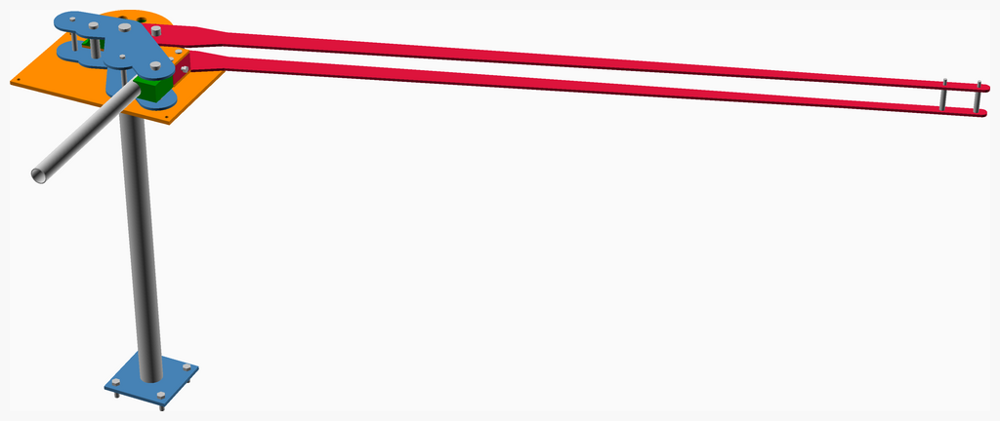
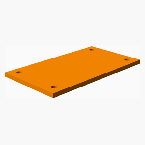
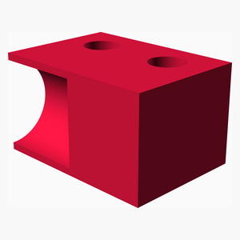
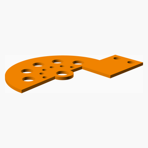
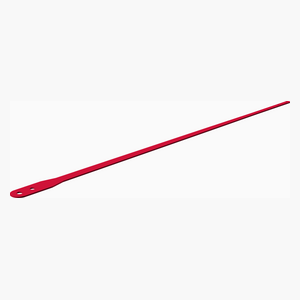
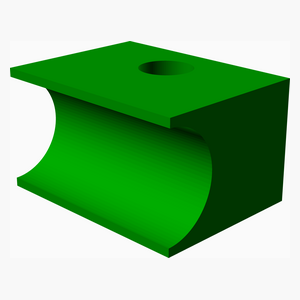
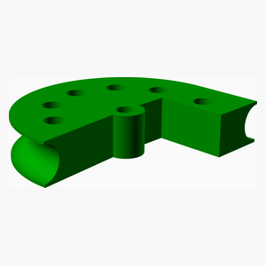
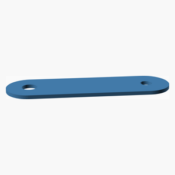
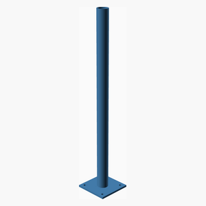
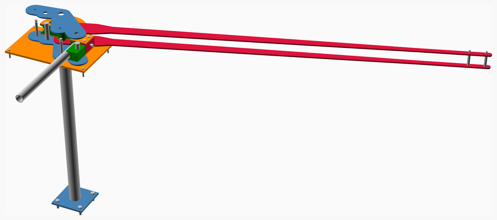

# Tube-bender
A parametric manual rotary-draw tube bender, from 1/8 in to 2 in outside diameter.

The machine is the swing-arm pattern that J D Squared and Pro-Tools have sold for
decades: a grooved forming die on a centre pivot, a U-strap clamping the tube to it, a
followbar reacting the bending load, and a drive link that rotates the die from a
handle. What is new here is that it is derived rather than drawn - the die comes from
the tube, the pins come from the loads they carry, and the base bolt pattern comes from
the torque it has to react.

Every part of the working mechanism is built and derived: the forming die - machined
from one plate or stacked from flat-cut slices, behind the same interface - its plates,
the clamp, the followbar, the tapered frame and drive links, the die lock that holds the
die against springback between strokes, and a bench base or a pedestal.

## Driving it

Open this file in OpenSCAD and use the **Customizer** (Window > Customizer). Everything
that decides what the machine is has a control there: the tube, the bend, the plate
stock, the die style, the mounting, and which part to look at. `tube_bender.json` beside
this file carries a few worked configurations to start from, including the 1-1/2 in
prototype and a sliced-die build for a shop with no mill.

The **Units** tab switches the report and the BOM between metric and imperial as a
whole system - length, force, moment, stress and mass together, because inches with
newtons is harder to check than either on its own. It changes nothing that is
calculated, and it changes no name: a tube is "1-1/2 in OD x 0.095 in wall" and plate is
ordered as "1/4 in" in both.

Nothing in the Customizer is a dimension of a part. Every part is derived from the tube
and the loads, so choosing a 1 in tube resizes the die, the pins, the links, the base
and the handle together - and the arithmetic behind that is echoed rather than hidden.
`just report` prints it, or read the console after any render.

Why the numbers are what they are, and what each one rests on, is in
[docs/design-basis.md](docs/design-basis.md). What the Onshape prototype this was
started from actually measured, and which of its features survived, is in
[docs/reverse-engineering.md](docs/reverse-engineering.md).

---
## Table of Contents
1. [Parts list](#Parts_list)
1. [Main Assembly](#main_assembly)

[Top](#TOP)

---

## Parts list
| Main | TOTALS |  |
|---:|---:|:---|
|  | | **Vitamins** |
| &nbsp;&nbsp;4&nbsp; |  &nbsp;&nbsp;4&nbsp; | &nbsp;&nbsp; Bolt hex head 1/2 in x 39.53 mm, with nut and washers, NO ORDER NUMBER - this row is a hole in the BOM |
| &nbsp;&nbsp;1&nbsp; |  &nbsp;&nbsp;1&nbsp; | &nbsp;&nbsp; Pin clevis 1-1/8 in dia x 90.55 mm, NO ORDER NUMBER - this row is a hole in the BOM |
| &nbsp;&nbsp;1&nbsp; |  &nbsp;&nbsp;1&nbsp; | &nbsp;&nbsp; Pin clevis 3/4 in dia x 90.55 mm, 98306A868 |
| &nbsp;&nbsp;2&nbsp; |  &nbsp;&nbsp;2&nbsp; | &nbsp;&nbsp; Pin clevis 5/16 in dia x 83.7 mm, NO ORDER NUMBER - this row is a hole in the BOM |
| &nbsp;&nbsp;2&nbsp; |  &nbsp;&nbsp;2&nbsp; | &nbsp;&nbsp; Pin clevis 5/8 in dia x 63.15 mm, NO ORDER NUMBER - this row is a hole in the BOM |
| &nbsp;&nbsp;1&nbsp; |  &nbsp;&nbsp;1&nbsp; | &nbsp;&nbsp; Pin clevis 7/8 in dia x 83.7 mm, NO ORDER NUMBER - this row is a hole in the BOM |
| &nbsp;&nbsp;1&nbsp; |  &nbsp;&nbsp;1&nbsp; | &nbsp;&nbsp; Pin clevis 7/8 in dia x 90.55 mm, NO ORDER NUMBER - this row is a hole in the BOM |
| &nbsp;&nbsp;1&nbsp; |  &nbsp;&nbsp;1&nbsp; | &nbsp;&nbsp; Plate mild steel 1-3/4 in, blank 228.6 x 190.5 mm, faced to 44.45 mm |
| &nbsp;&nbsp;1&nbsp; |  &nbsp;&nbsp;1&nbsp; | &nbsp;&nbsp; Plate mild steel 1-3/4 in, blank 54.37 x 76.2 mm, faced to 44.45 mm |
| &nbsp;&nbsp;1&nbsp; |  &nbsp;&nbsp;1&nbsp; | &nbsp;&nbsp; Plate mild steel 1-3/4 in, blank 57.55 x 76.2 mm, faced to 44.45 mm |
| &nbsp;&nbsp;2&nbsp; |  &nbsp;&nbsp;2&nbsp; | &nbsp;&nbsp; Plate mild steel 1/4 in, blank 2034.1 x 86.93 mm |
| &nbsp;&nbsp;2&nbsp; |  &nbsp;&nbsp;2&nbsp; | &nbsp;&nbsp; Plate mild steel 1/4 in, blank 228.6 x 190.5 mm |
| &nbsp;&nbsp;2&nbsp; |  &nbsp;&nbsp;2&nbsp; | &nbsp;&nbsp; Plate mild steel 1/4 in, blank 309.09 x 232.97 mm |
| &nbsp;&nbsp;1&nbsp; |  &nbsp;&nbsp;1&nbsp; | &nbsp;&nbsp; Plate mild steel 3/8 in, blank 171.45 x 171.45 mm |
| &nbsp;&nbsp;1&nbsp; |  &nbsp;&nbsp;1&nbsp; | &nbsp;&nbsp; Plate mild steel 3/8 in, blank 283.44 x 173.85 mm |
| &nbsp;&nbsp;1&nbsp; |  &nbsp;&nbsp;1&nbsp; | &nbsp;&nbsp; Tube 1-1/2 in OD x 0.095 in wall, ASTM A513 Type 1 ERW mild steel, as-welded, length 600 mm |
| &nbsp;&nbsp;2&nbsp; |  &nbsp;&nbsp;2&nbsp; | &nbsp;&nbsp; Tube 1/2 in OD x 0.065 in wall, mild steel, length 58.15 mm |
| &nbsp;&nbsp;1&nbsp; |  &nbsp;&nbsp;1&nbsp; | &nbsp;&nbsp; Tube 2-1/4 in OD x 0.120 in wall, mild steel, length 898.2 mm |
| &nbsp;&nbsp;27&nbsp; | &nbsp;&nbsp;27&nbsp; | &nbsp;&nbsp;Total vitamins count |
|  | | **3D printed parts** |
| &nbsp;&nbsp;1&nbsp; |  &nbsp;&nbsp;1&nbsp; | &nbsp;&nbsp;base.stl |
| &nbsp;&nbsp;1&nbsp; |  &nbsp;&nbsp;1&nbsp; | &nbsp;&nbsp;clamp.stl |
| &nbsp;&nbsp;2&nbsp; |  &nbsp;&nbsp;2&nbsp; | &nbsp;&nbsp;die_plate.stl |
| &nbsp;&nbsp;2&nbsp; |  &nbsp;&nbsp;2&nbsp; | &nbsp;&nbsp;drive_link.stl |
| &nbsp;&nbsp;1&nbsp; |  &nbsp;&nbsp;1&nbsp; | &nbsp;&nbsp;followbar.stl |
| &nbsp;&nbsp;1&nbsp; |  &nbsp;&nbsp;1&nbsp; | &nbsp;&nbsp;forming_die.stl |
| &nbsp;&nbsp;2&nbsp; |  &nbsp;&nbsp;2&nbsp; | &nbsp;&nbsp;frame_link.stl |
| &nbsp;&nbsp;1&nbsp; |  &nbsp;&nbsp;1&nbsp; | &nbsp;&nbsp;pedestal.stl |
| &nbsp;&nbsp;11&nbsp; | &nbsp;&nbsp;11&nbsp; | &nbsp;&nbsp;Total 3D printed parts count |

[Top](#TOP)

---

## Main Assembly
### Vitamins
|Qty|Description|
|---:|:----------|
|4| Bolt hex head 1/2 in x 39.53 mm, with nut and washers, NO ORDER NUMBER - this row is a hole in the BOM|
|1| Pin clevis 1-1/8 in dia x 90.55 mm, NO ORDER NUMBER - this row is a hole in the BOM|
|1| Pin clevis 3/4 in dia x 90.55 mm, 98306A868|
|2| Pin clevis 5/16 in dia x 83.7 mm, NO ORDER NUMBER - this row is a hole in the BOM|
|2| Pin clevis 5/8 in dia x 63.15 mm, NO ORDER NUMBER - this row is a hole in the BOM|
|1| Pin clevis 7/8 in dia x 83.7 mm, NO ORDER NUMBER - this row is a hole in the BOM|
|1| Pin clevis 7/8 in dia x 90.55 mm, NO ORDER NUMBER - this row is a hole in the BOM|
|1| Plate mild steel 1-3/4 in, blank 228.6 x 190.5 mm, faced to 44.45 mm|
|1| Plate mild steel 1-3/4 in, blank 54.37 x 76.2 mm, faced to 44.45 mm|
|1| Plate mild steel 1-3/4 in, blank 57.55 x 76.2 mm, faced to 44.45 mm|
|2| Plate mild steel 1/4 in, blank 2034.1 x 86.93 mm|
|2| Plate mild steel 1/4 in, blank 228.6 x 190.5 mm|
|2| Plate mild steel 1/4 in, blank 309.09 x 232.97 mm|
|1| Plate mild steel 3/8 in, blank 171.45 x 171.45 mm|
|1| Plate mild steel 3/8 in, blank 283.44 x 173.85 mm|
|1| Tube 1-1/2 in OD x 0.095 in wall, ASTM A513 Type 1 ERW mild steel, as-welded, length 600 mm|
|2| Tube 1/2 in OD x 0.065 in wall, mild steel, length 58.15 mm|
|1| Tube 2-1/4 in OD x 0.120 in wall, mild steel, length 898.2 mm|

### 3D Printed parts

| 1 x [base.stl](stls/base.stl) | 1 x [clamp.stl](stls/clamp.stl) | 2 x [die_plate.stl](stls/die_plate.stl) |
|---|---|---|
|  |  |  

| 2 x [drive_link.stl](stls/drive_link.stl) | 1 x [followbar.stl](stls/followbar.stl) | 1 x [forming_die.stl](stls/forming_die.stl) |
|---|---|---|
|  |  |  

| 2 x [frame_link.stl](stls/frame_link.stl) | 1 x [pedestal.stl](stls/pedestal.stl) |
|---|---|
|  |  

### Assembly instructions

The stack, with the tube where it goes in. The handle, the followbar, the U-strap and
the base are not built yet.

[Top](#TOP)
